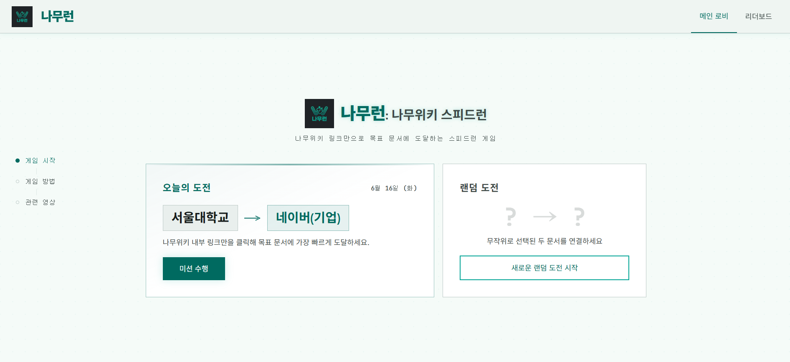
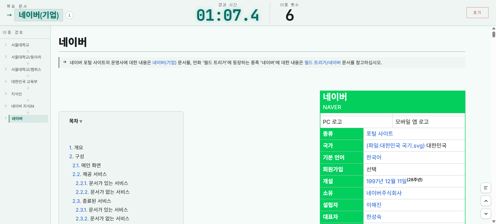
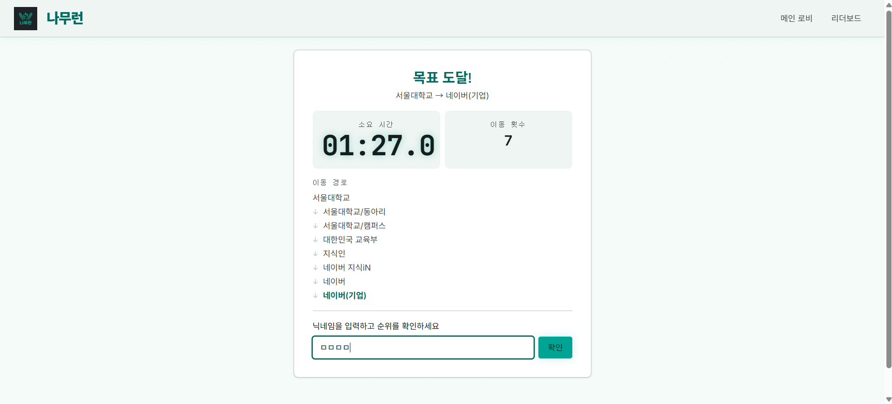
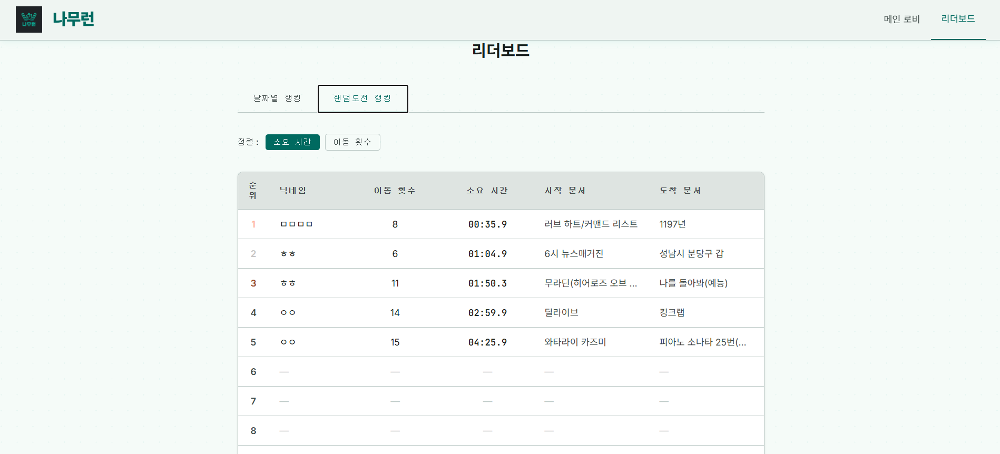

# 🌳 나무런 (Namurun)

> 나무위키의 내부 링크만 클릭해서 목표 문서에 가장 빠르게 도달하는 스피드런 웹 게임

**[위키피디아 스피드런(The Wiki Game)](https://wikispeedruns.com/)** 의 나무위키 버전입니다.

🔗 **[namurun-yhaeul.vercel.app](https://namurun-yhaeul.vercel.app/)**

---

## 🎮 어떤 게임인가요?

"조선시대"에서 시작해서 "아이유"까지 몇 번 만에 도달할 수 있을까요?

나무런은 나무위키 문서 안의 링크만 클릭해서 목표 문서에 도달하는 게임입니다.
클릭 수가 적을수록, 시간이 빠를수록 높은 순위를 얻습니다.

```
시작 문서 진입
  → 문서 안의 링크를 클릭해 이동
  → 목표 문서 도달 🎉
  → 클릭 수 · 소요 시간 기록 후 리더보드 등록
```

### 📸 스크린샷

| 메인 화면 | 게임 화면 |
|-----------|-----------|
|  |  |

| 결과 화면 | 리더보드 |
|-----------|----------|
|  |  |

---

### ✨ 핵심 기능

| 기능 | 설명 |
|------|------|
| 📅 일일 문제 | 매일 고정된 시작·도착 문서 쌍. 전 세계 유저와 같은 조건으로 경쟁 |
| 🎲 랜덤 스피드런 | 무작위 문서 쌍으로 즉석 도전 |
| 🏆 리더보드 | 동일 문제 기준 클릭 수 → 소요 시간 순 랭킹 |
| 🤖 목표 문서 힌트 | AI(Gemini)가 목표 문서를 한 줄로 설명 |

---

## 🛠 기술 스택

| 영역 | 기술 | 선택 이유 |
|------|------|----------|
| 프론트엔드 | React + TypeScript + Vite | 컴포넌트 기반 UI, 타입 안정성, 빠른 HMR |
| 스타일링 | Tailwind CSS v4 | CSS-first 방식, 별도 config 불필요 |
| 호스팅 | Vercel | 프론트엔드 무료 배포, GitHub 자동 연동 |
| 데이터베이스 | Supabase (PostgreSQL) | 무료 티어, REST API 내장, 리더보드 집계 |
| 파일 스토리지 | Cloudflare R2 | Egress 무료, CDN 캐싱, 문서 JSON 서빙 |
| 마크업 파서 | namumark-clone-core | TypeScript 나무마크 렌더링 구현체 |
| 데이터 | 나무위키 덤프 (CC BY-NC-SA 2.0 KR) | heegyu/namuwiki (HuggingFace, 867K 문서) |
| AI | Google Gemini API | 목표 문서 한 줄 요약 |

### 왜 나무위키 덤프를 쓰나요?

나무위키는 공식 API가 없습니다. iframe은 `X-Frame-Options`로 차단되고, 실시간 크롤링은 이용약관 위반입니다. **덤프 데이터 활용이 유일한 합법적 선택지**였습니다.

867,024개 문서를 전처리해 Cloudflare R2(본문 JSON)와 Supabase(메타데이터)에 적재했습니다.

---

## 🏗 아키텍처

```
[메인 화면]
  ├─ 오늘의 문제 (Supabase daily_prompts)
  └─ 랜덤 스피드런 (ID 기반 랜덤 문서 선택)

      ↓ 게임 시작

[게임 화면]
  ├─ 문서 본문: R2 fetch → namumark-clone-core (Web Worker) → 렌더링
  ├─ 링크 클릭 → Supabase redirects 확인 → 다음 문서 이동
  ├─ 헤더: 목표 문서 · 타이머 · 이동 횟수
  └─ 사이드바: 현재까지 이동 경로

      ↓ 목표 문서 도달

[결과 화면]
  └─ 소요 시간 · 이동 횟수 · 경로 표시 → Supabase game_records 저장

[리더보드]
  └─ 동일 문제 기준 상위 10개 (일일/랜덤 탭 분리)
```

**데이터 저장 분리 이유**

| 데이터 | 위치 | 이유 |
|--------|------|------|
| 문서 본문 | Cloudflare R2 | 문서당 수십KB — Key-Value 즉시 접근 + CDN 캐싱 |
| 메타데이터 · 리다이렉트 | Supabase | 쿼리 필요 (랜덤 추출, 리다이렉트 확인) |
| 게임 기록 | Supabase | 리더보드 집계 쿼리 필요 |

---

## 💻 로컬 실행

```bash
# 저장소 클론
git clone https://github.com/boostcampwm-snu-2026-1/namurun-yhaeul.git
cd namurun-yhaeul

# 의존성 설치
npm install

# 환경변수 설정
cp .env.example .env.local
# .env.local에 Supabase, R2, Gemini API 키 입력

# 개발 서버 실행
npm run dev
# → http://localhost:5173
```

환경변수 목록은 `.env.example` 참고

```bash
npm run dev       # 개발 서버
npm run build     # 프로덕션 빌드
npm run lint      # ESLint
npm run test:run  # 테스트 (vitest)
```

---

## 🌿 브랜치 전략

```
main (배포, 직접 커밋 금지)
 └─ dev (개발 통합)
     └─ feature/* / fix/* (기능·버그)
```

`feature/*` → `dev` PR → `dev` → `main` PR (배포 시)

---

## 🔄 데이터 파이프라인 (1회성 로컬 실행)

```
HuggingFace heegyu/namuwiki .parquet 다운로드
  → Python(Pandas) 전처리
    - 리다이렉트 문서 → Supabase redirects 테이블
    - 일반 문서 필터링 (1,000바이트↑, 내부 링크 5개↑)
    - 내부 링크 추출 ([[문서명]] 패턴)
  → 본문 JSON → Cloudflare R2 병렬 업로드 (gzip 압축, ~78% 감소)
  → 메타데이터 → Supabase bulk INSERT
```

---

## 📄 라이선스

본 서비스는 나무위키 데이터를 기반으로 합니다.  
나무위키 덤프 데이터는 **[CC BY-NC-SA 2.0 KR](https://creativecommons.org/licenses/by-nc-sa/2.0/kr/)** 라이선스를 따릅니다.

- 출처 표기 필수
- 비상업적 이용만 허용
- 동일 라이선스 적용

소스코드는 [LICENSE](./LICENSE) 파일을 참고하세요.
